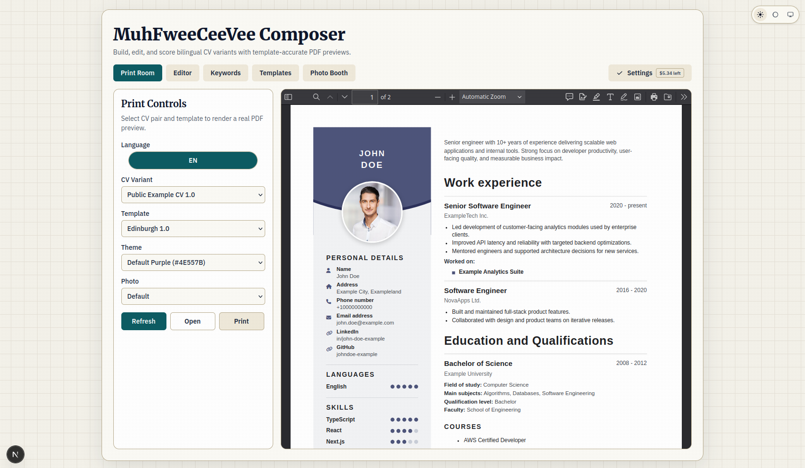
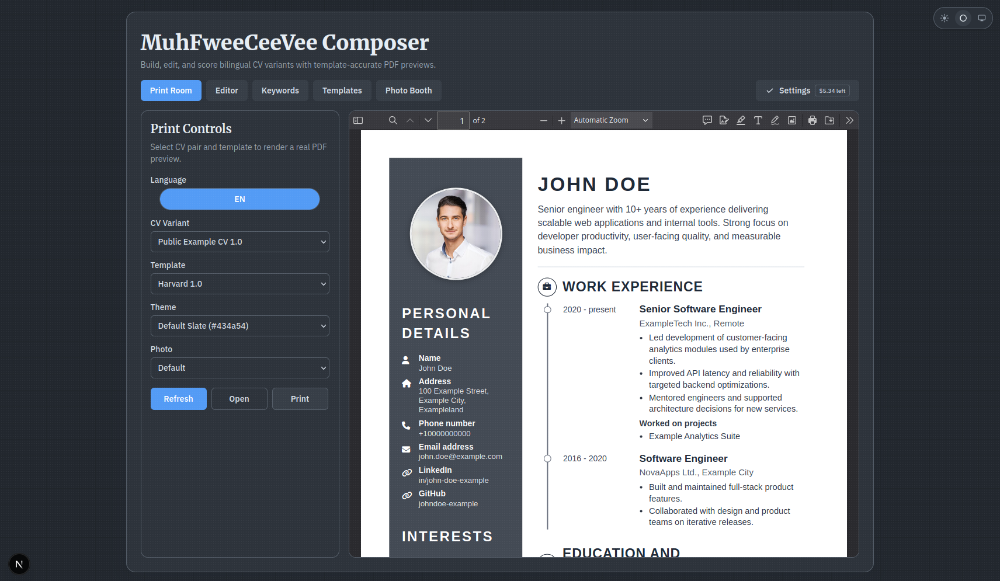
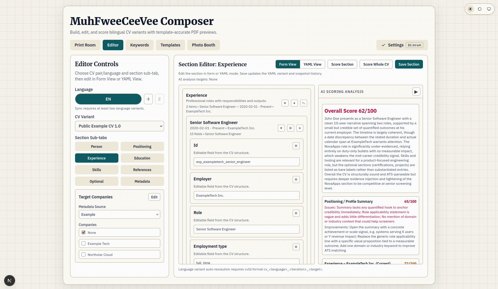
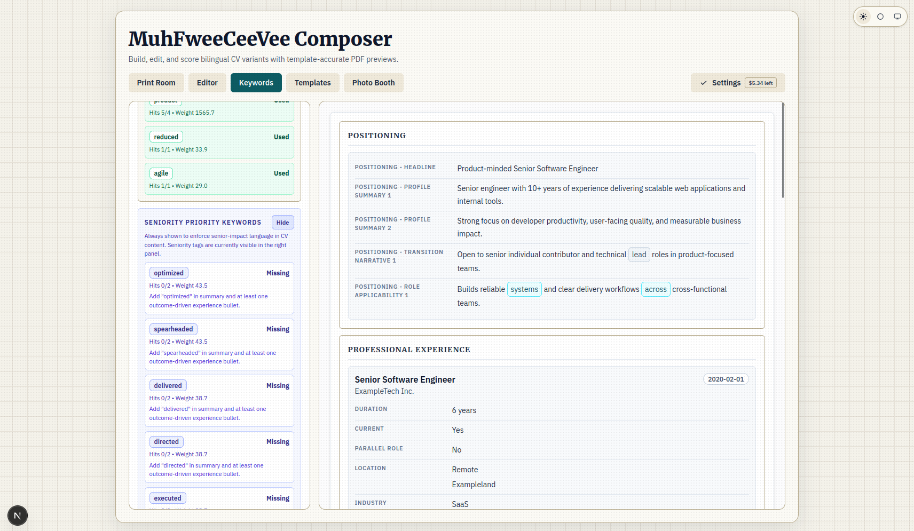
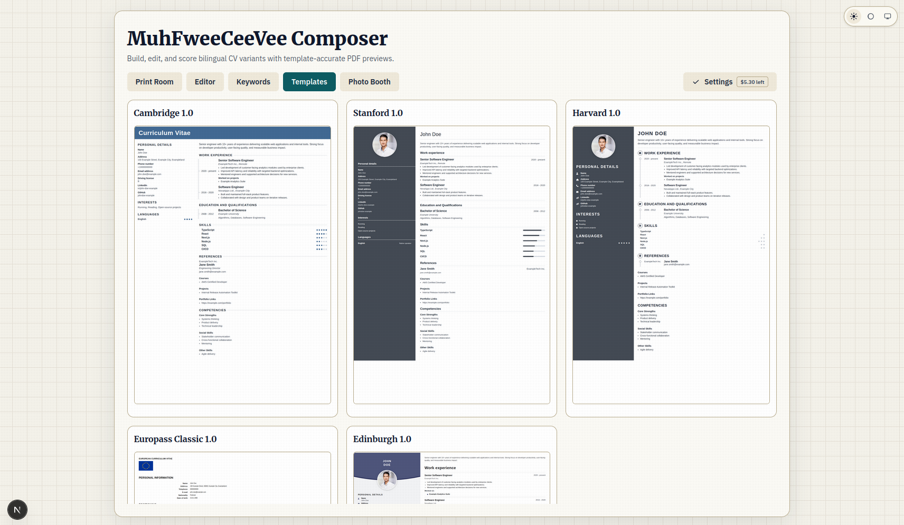
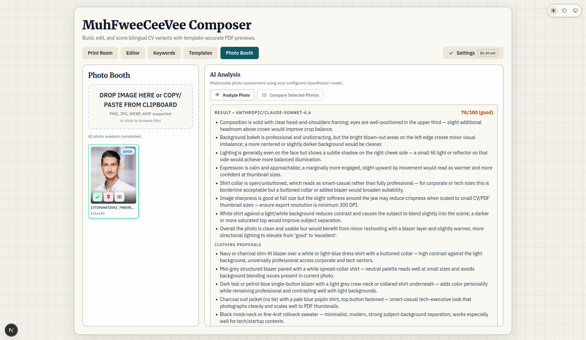

# MuhFweeCeeVee

MuhFweeCeeVee started as a practical “enough is enough” project: paying recurring CV-tool subscriptions for features that can be built and customized in a few focused days did not make sense anymore.

The core goal is simple:
- save roughly **$15-$20 per month** (or more) versus common CV SaaS plans
- keep full control of your data and workflow
- quickly customize the product to fit your own job-search style

In short: why rent your resume workflow forever, when you can own it and make it **fwee**.

## Why This Exists (Cost Comparison)

| Service | Typical Paid Cost | Paid Features | Vs MuhFweeCeeVee |
| --- | ---: | --- | --- |
| Resume.io | $29.95 / 4 weeks (after $2.95 7-day trial) | Resume builder, cover letters, templates, PDF downloads | MuhFweeCeeVee has local-first CV editing/export; cover letters are **Coming Soon** |
| Kickresume | $24/mo monthly, $18/mo quarterly, $8/mo yearly | Resume + cover letter templates, ATS checker, AI writer | MuhFweeCeeVee has AI analysis and template workflow; ATS-style checker polish is **Coming Soon** |
| VisualCV | $16/mo billed quarterly | Resume templates, unlimited resumes, PDFs, share links, website profile | MuhFweeCeeVee has customizable local workflow; public profile website flow is **Coming Soon** |
| Teal+ | $13/week | Resume builder, keyword matching, job tracking, AI credits | MuhFweeCeeVee has keyword analysis; integrated job-tracker workflow is **Coming Soon** |
| **MuhFweeCeeVee** | **fwee** | Local self-hosted CV composer, template rendering, YAML/Form editing, PDF export, AI scoring, keyword workspace, photo analysis | Built to be owned + customized; Companies and Cover Letters tabs are in progress (**Coming Soon**) |

## Features

### 1) Print, preview, and theme confidence
Use Print Room to configure CV/template output and immediately validate readability in both light and dark visual modes before export.

<p align="center">
  
  
</p>

### 2) Edit precision + job-fit diagnostics
Combine structured section editing with AI scoring and keyword-gap analysis so every change can be checked for recruiter relevance and missing signal.

<p align="center">
  
  
</p>

### 3) Presentation polish and profile quality
Review available CV templates side-by-side, then finalize profile-photo quality using Photo Booth analysis and recommendations.

<p align="center">
  
  
</p>

MuhFweeCeeVee is a self-hosted CV authoring and export platform with:
- template-based rendering (`cambridge-v1`, `stanford-v1`, `harvard-v1`, `europass-v1`, `edinburgh-v1`)
- form + YAML editor workflows
- AI scoring and keyword analysis surfaces
- CV AI analysis that can target a selected company from external companies metadata
- PDF export pipeline for print-ready output

## 1.0.2 Release Scope

Version `1.0.2` is the current public release with a stable user-facing workflow:
- Print Room (preview + export)
- Editor (Form/YAML)
- Editor Form View includes collapsible nested containers (collapsed by default for deep structures) with compact summary metadata for faster navigation.
- Experience entries in Form View are labeled with role-first titles and period/company subtitles instead of generic numbered labels.
- Settings (OpenRouter login, Analysis Model, Image Generation Model for future use, base URL, credit status, and per-check cost estimates)
- AI analysis targeting with metadata-source selection, multi-company checkbox selection, and inline Form/YAML metadata editing
- Dynamic language variants in Editor (add language + optional AI translation)
- Variant auto-resolution supports both id styles:
  `cv_<language>_<target>` and `cv_<language>_<iteration>_<target>`.
- Language sync modal in Editor (pick source/target language pair with timestamp visibility)
- Keywords workspace (gap analysis and prioritization)
- Theme support (light/dark/system + template themes)
- Print Room photo customization modes (default/circle/square/original-ratio/off)
- Public fictional sample profile (`John Doe`)
- Tracked example company metadata plus an untracked personal company metadata file
- Privacy hardening for local/private artifacts (personal CVs, local DB/snapshots, editor/runtime files) to keep them out of git by default

## Repository Layout

- `apps/web/`: Next.js web application
- `services/parser/`: FastAPI parser service scaffold
- `packages/schemas/`: shared schema/constants
- `packages/render-core/`: shared rendering primitives
- `data/`: sample CV and template mapping data
- `templates/`: template definitions and assets
- `deploy/systemd/`, `deploy/nginx/`: Linux deployment references

## Prerequisites

- Node.js `>= 22`
- npm `>= 10`
- Python `3.12.x` (for parser service)

## Quick Start (Local)

```bash
npm run bootstrap
npm run dev
```

Optional parser service (second terminal):

```bash
npm run dev:parser
```

Quality checks:

```bash
npm run lint
npm run typecheck
```

Keywords troubleshooting:

- If the Keywords tab shows empty JD results despite existing cache data, set `SQLITE_BIN` to your sqlite executable path (for example `export SQLITE_BIN=/home/linuxbrew/.linuxbrew/bin/sqlite3`) before starting the web app.

## Production Build

```bash
npm run bootstrap
npm run build
npm run start
```

Default web runtime port is `3000` unless overridden by environment.

## Hosting Guide

### Windows 11

Recommended stack:
- app process: Node.js (`npm run build && npm run start`)
- optional parser process: Python `uvicorn`
- reverse proxy / TLS: Caddy (recommended) or IIS reverse proxy

Steps:
1. Install Node.js 22+ and Python 3.12.
2. Clone repo and run `npm run bootstrap`.
3. Build web: `npm run build`.
4. Run web as background service using NSSM or Windows Task Scheduler:
   - program: `npm`
   - args: `run start`
   - working dir: repo root
5. (Optional) run parser service with its own NSSM entry:
   - `cd services/parser`
   - `python -m venv .venv`
   - `.venv\Scripts\pip install -r requirements.txt`
   - `.venv\Scripts\uvicorn main:app --host 127.0.0.1 --port 8001`
6. Configure Caddy/IIS to proxy HTTPS traffic to `127.0.0.1:3000`.

### Linux (Ubuntu/Debian/RHEL)

Recommended stack:
- app process: systemd service for Next.js
- optional parser process: systemd service for FastAPI
- reverse proxy / TLS: nginx or Caddy

Steps:
1. Install Node.js 22+, npm 10+, Python 3.12.
2. Clone repo and run `npm run bootstrap`.
3. Build web: `npm run build`.
4. Create systemd unit for web process (`npm run start`).
5. (Optional) create parser venv and systemd unit for uvicorn on `127.0.0.1:8001`.
6. Configure nginx/Caddy reverse proxy and HTTPS certs.
7. Enable auto-start:
   - `sudo systemctl enable --now <web-service>`
   - `sudo systemctl enable --now <parser-service>` (if used)

### macOS

Recommended stack:
- app process: Node.js (`npm run build && npm run start`)
- optional parser process: Python `uvicorn`
- service manager: `launchd` (LaunchAgent/LaunchDaemon)
- reverse proxy / TLS: Caddy or nginx

Steps:
1. Install Node.js 22+ and Python 3.12 (Homebrew recommended).
2. Clone repo and run `npm run bootstrap`.
3. Build web: `npm run build`.
4. Create `launchd` plist for `npm run start` in repo root.
5. (Optional) create parser `launchd` plist for uvicorn on `127.0.0.1:8001`.
6. Configure Caddy/nginx to expose HTTPS and proxy to `127.0.0.1:3000`.

## Runtime Data and Privacy

- Public repo includes only fictional sample CV data.
- Personal/local CV history and planning artifacts are intentionally untracked.
- Keep real CV content in local/private files outside version control.
- OpenRouter key is stored in local `.env` as `OPENROUTER_API_KEY` when saved via UI.

## Release and Changelog

- Changelog is the source of truth for release notes:
  - [`CHANGELOG.md`](CHANGELOG.md)
- API reference (including post-1.0.0 additions):
  - [`docs/API.md`](docs/API.md)
- MCP wrapper guide:
  - [`mcp.md`](mcp.md)

## License

This project is licensed under the MIT License. See [`LICENSE`](LICENSE).
Template-specific license metadata lives under each template folder.
